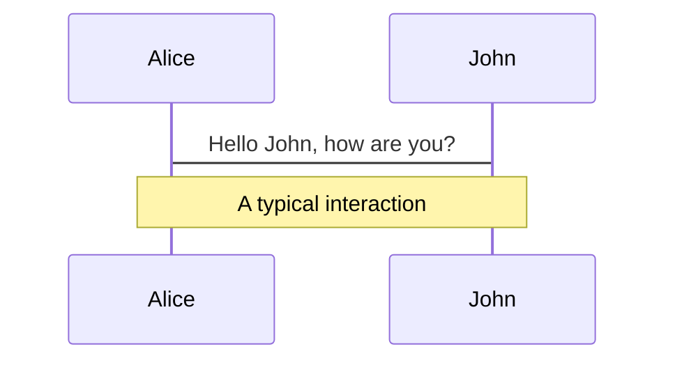
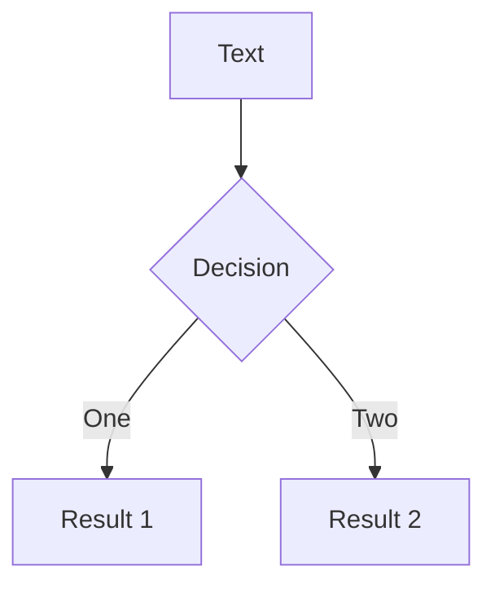
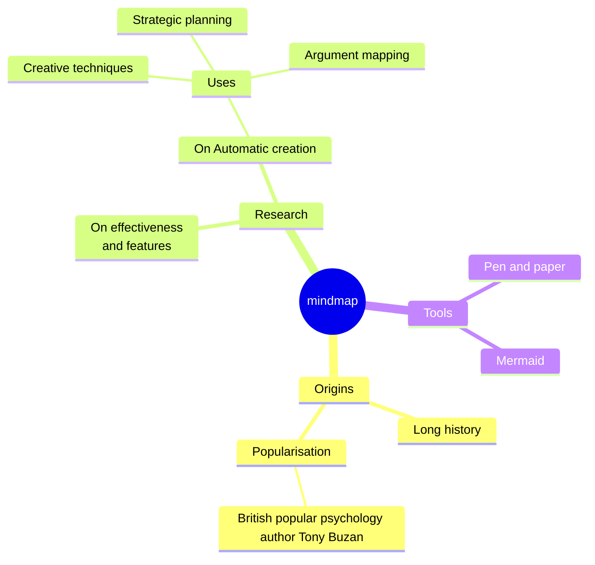
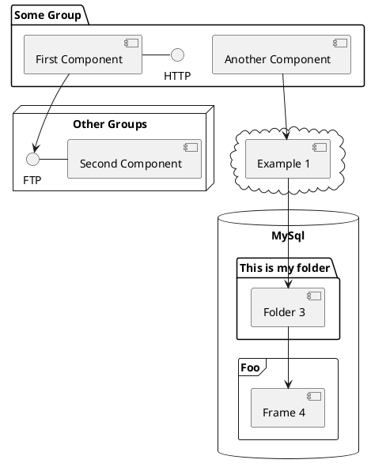

# Integration testing

Overview of best practices for integration testing.

<!--
Today I'll be talking about testing and specifically integration testing. I'll go into a bit of theory at the beginning of the presentation and then jump straight into practical examples, since those are the most fun.

You might be lucky and when you're placed in a on-going project as an consultant or a new employee, where there might be already a set of guidelines on how you do testing. If that's you that's great, I'm happy for you. 

I was never as lucky. In every on going project I've joined has a mixture of NUnit- XUnit libraries, Unit tests, a very weird attempts on integration testing that don't test anything else other than which status code the controller is returning, unit tests that depend on each other and sprinkled in some k6 load testing places that didn't make any sense because "just for fun". And usually none of the tests actually tested if the result of the endpoint if correct.

Combination of all of those factors led me to just make changes in the code and avoid making any changes to those tests, since the testing suite was more fragile than the code itself. 
-->

---
transition: none
layout: two-cols
---

# Unit test
<!-- <v-click>

The <span v-mark.red="3"><code>v-mark</code> directive</span>
also allows you to add
<span v-mark.circle.orange="4">inline marks</span>
, powered by [Rough Notation](https://roughnotation.com/):

```html
<span v-mark.underline.orange>inline markers</span>
``` -->
  - <span v-mark.circle.orange="2">Fast</span>
  - <span v-mark.strike-through.orange="4">Isolated</span>
  - <span v-mark.circle.orange="1">Repeatable</span>
  - <span v-mark.circle.orange="4">Self-validating</span>
  - <span v-mark.strike-through.orange="4">"Solitary"</span>

::right::

# Integration test 

- <span v-mark.strike-through.orange="4">Slow</span>
- External dependencies
- <span v-mark.strike-through.orange="4">Less deterministic</span>
- <span v-mark.strike-through.orange="4">Flaky</span>
- <span v-mark.circle.orange="3">"Sociable"</span>


<!-- There are 2 camps with 2 different definitions of integration testing.
- First camp only calls tests integration tests when NO mocks are used are you're actually calling the real service or real database. 
- Second camp has a bit more flexible definition of integration testing, this is also what Microsoft's documentation tends to agree with, is that integration testing tests the whole picture with mocking kept to minimum. You generally don't use real database for this purpose, you might spin it up in memory or as a Docker container, but you rarely call external services.

When people talk about integration testing vs unit testing they often compare those two as if they're black and white. I've seen this comparison over and over again, and I don't agree with it.
People tend to describe unit tests as 
- Fast
- Isolated
- Repeatable
- Self-validating
- Timely
- "Solitary"

And integration tests as:
- Invokes multiple parts of the system together 
- External dependencies - flaky if you're calling third party system
- Less deterministic. Only goes towards real database / cache and uses real users and authorization.
- "Sociable"

I believe that those definitions can be combined together. 

 -->


---
---
# Testing methodology

<div style="margin-bottom: 20px;" v-click>
Only care about the <span v-mark.underscore.orange="1">output</span> of the system
</div>

<div style="margin-bottom: 20px;" v-click>
Most of the time mock out dependent systems - reduce flakiness 
</div>

<div style="margin-bottom: 20px;" v-click>
Create a Faker instead with exact expected result from external dependency
</div>

<div style="margin-bottom: 20px;" v-click>
Test DI and all the parts of the internal system
</div>

<div style="margin-bottom: 20px;" v-click>
Tests must be short and concise
</div>

<div style="margin-bottom: 20px;" v-click>
Grand goal of testing: being able to trust tests in a way where any changes made to the codebase can be pushed<span v-mark.underscore.orange="6"> without or with minimal manual testing. </span>
</div>


# Acceptance criteria

GIVEN the user is owner of the account or an admin
WHEN user tries to get user information
THEN return Ok 
AND users name, last name, social security number and address. 

---
transition: slide-left
---
# Where do we start

```csharp
public class GetUserInformation()
{
  // step 1: happy path test
  [Fact]
    public async Task Should_return_users_information_if_user_number_exists_and_user_is_admin() {
      // Arrange
      var userNumber = "123456789";

      // Act
      var response = await this.client.GetAsync($"user-information/{userNumber}");
      var content = await response.Content.ReadAsStringAsync();
      var contactInformationResponse = JsonSerializer.Deserialize<UserInformationDto>
      (content, new JsonSerializerOptions
      {
          PropertyNameCaseInsensitive = true,
      });

      // Assert
    }
}
```
---
transition: slide-left
---
# Abstract away
```csharp
public static class Json
{
    public static T? Deserialize<T>(string json, JsonSerializerOptions? options = null) where T : class
    {
        options ??= new JsonSerializerOptions()
        {
            PropertyNameCaseInsensitive = true,
        };

        return JsonSerializer.Deserialize<T>(json, options);
    }
}
```
---
transition: slide-left
---
# Apply
````md magic-move {lines: true}
```csharp {*}
public class GetUserInformation()
{
  // step 2 : clean up
  [Fact]
  public async Task Should_return_users_information_if_user_number_exists_and_user_is_admin() {
    // Arrange
    var userNumber = "123456789";

    // Act
    var response = await this.client.GetAsync($"user-information/{userNumber}");
    var content = await response.Content.ReadAsStringAsync();
    var contactInformationResponse = JsonSerializer.Deserialize<UserInformationDto>
    (content, new JsonSerializerOptions
    {
      PropertyNameCaseInsensitive = true,
    });

    // Assert
  }
}
```
```csharp
{
  // step 2 : clean up
  [Fact]
  public async Task Should_return_users_information_if_user_number_exists_and_user_is_admin() {
    // Arrange
    var userNumber = "123456789";

    // Act
    var response = await this.client.GetAsync($"user-information/{userNumber}");
    var content = await response.Content.ReadAsStringAsync();
    var userInformationResponse = Json.Deserialize<UserInformationDto>(content);

    // Assert
  }
}
```
````
---
transition: slide-left
---
# WebApplicationFactory

````md magic-move {lines: true}
```csharp {*}
{
  // step 3 : Create a WebApplicationFactory
   public static WebApplicationFactory<T> WebApplicationFactory<T>(IServiceCollection testServices, 
   bool enableTestAuthPolicy) where T : class =>
        new WebApplicationFactory<T>()
            .WithWebHostBuilder(builder =>
            {
                // Override appsettings.Development.json
                builder.UseEnvironment("IntegrationTesting");
                builder.ConfigureAppConfiguration((context, config) => { config.AddJsonFile($"appsettings.IntegrationTests.json").AddEnvironmentVariables(); });

                builder.ConfigureTestServices(services =>
                {
                    // Remove services
                    services.Remove(services.SingleOrDefault(descriptor => descriptor.ServiceType == typeof(DbContextOptions<PostgresDbContext>)));
                    services.Remove(services.SingleOrDefault(descriptor => descriptor.ServiceType == typeof(NpgSqlHealthCheck)));
                    services.Remove(services.SingleOrDefault(descriptor => descriptor.ServiceType == typeof(SqlServerHealthCheck)));
                    services.Remove(services.SingleOrDefault(des => des.ServiceType == typeof(AuthenticationService)));

                    if (enableTestAuthPolicy)
                    {
                        services.AddSingleton<IPolicyEvaluator, TestingPolicyEvaluator>();
                    }

                    // Add instance of in memory db
                    services.AddDbContext<PostgresDbContext>((sp, options) =>
                    {
                        options.UseInMemoryDatabase("InMemoryDbForTesting");
                    });
                    foreach (var service in testServices)
                    {
                        services.Add(service);
                    }
                });
            });
}
```
```csharp
{
  // step 3 : Create a WebApplicationFactory
   public static WebApplicationFactory<T> WebApplicationFactory<T>(IServiceCollection testServices, 
   bool enableTestAuthPolicy) where T : class =>
        new WebApplicationFactory<T>()
            .WithWebHostBuilder(builder =>
            {
                {...}
                    if (enableTestAuthPolicy)
                    {
                        services.AddSingleton<IPolicyEvaluator, TestingPolicyEvaluator>();
                    }

                    // Add instance of in memory db
                    services.AddDbContext<PostgresDbContext>((sp, options) =>
                    {
                        options.UseInMemoryDatabase("InMemoryDbForTesting");
                    });
                    foreach (var service in testServices)
                    {
                        services.Add(service);
                    }
                });
            });
}
```
````

---
layout: two-cols
image: https://cover.sli.dev
---
# Code

```ts {all|5|7|7-8|10|all} twoslash
// TwoSlash enables TypeScript hover information
// and errors in markdown code blocks
// More at https://shiki.style/packages/twoslash

import { computed, ref } from 'vue'

const count = ref(0)
const doubled = computed(() => count.value * 2)

doubled.value = 2
```

<arrow v-click="[4, 5]" x1="350" y1="310" x2="195" y2="334" color="#953" width="2" arrowSize="1" />

<!-- This allow you to embed external code blocks -->
<<< @/snippets/external.ts#snippet

<!-- Footer -->
[^1]: [Learn More](https://sli.dev/guide/syntax.html#line-highlighting)

<!-- Inline style -->
<style>
.footnotes-sep {
  @apply mt-5 opacity-10;
}
.footnotes {
  @apply text-sm opacity-75;
}
.footnote-backref {
  display: none;
}
</style>

<!--
Notes can also sync with clicks

[click] This will be highlighted after the first click

[click] Highlighted with `count = ref(0)`

[click:3] Last click (skip two clicks)
-->

---
level: 2
---

# Shiki Magic Move

Powered by [shiki-magic-move](https://shiki-magic-move.netlify.app/), Slidev supports animations across multiple code snippets.

Add multiple code blocks and wrap them with <code>````md magic-move</code> (four backticks) to enable the magic move. For example:

````md magic-move {lines: true}
```ts {*|2|*}
// step 1
const author = reactive({
  name: 'John Doe',
  books: [
    'Vue 2 - Advanced Guide',
    'Vue 3 - Basic Guide',
    'Vue 4 - The Mystery'
  ]
})
```

```ts {*|1-2|3-4|3-4,8}
// step 2
export default {
  data() {
    return {
      author: {
        name: 'John Doe',
        books: [
          'Vue 2 - Advanced Guide',
          'Vue 3 - Basic Guide',
          'Vue 4 - The Mystery'
        ]
      }
    }
  }
}
```

```ts
// step 3
export default {
  data: () => ({
    author: {
      name: 'John Doe',
      books: [
        'Vue 2 - Advanced Guide',
        'Vue 3 - Basic Guide',
        'Vue 4 - The Mystery'
      ]
    }
  })
}
```

Non-code blocks are ignored.

```vue
<!-- step 4 -->
<script setup>
const author = {
  name: 'John Doe',
  books: [
    'Vue 2 - Advanced Guide',
    'Vue 3 - Basic Guide',
    'Vue 4 - The Mystery'
  ]
}
</script>
```
````

---

# Components

<div grid="~ cols-2 gap-4">
<div>

You can use Vue components directly inside your slides.

We have provided a few built-in components like `<Tweet/>` and `<Youtube/>` that you can use directly. And adding your custom components is also super easy.

```html
<Counter :count="10" />
```

<!-- ./components/Counter.vue -->
<Counter :count="10" m="t-4" />

Check out [the guides](https://sli.dev/builtin/components.html) for more.

</div>
<div>

```html
<Tweet id="1390115482657726468" />
```

<Tweet id="1390115482657726468" scale="0.65" />

</div>
</div>

<!--
Presenter note with **bold**, *italic*, and ~~striked~~ text.

Also, HTML elements are valid:
<div class="flex w-full">
  <span style="flex-grow: 1;">Left content</span>
  <span>Right content</span>
</div>
-->

---
class: px-20
---

# Themes

Slidev comes with powerful theming support. Themes can provide styles, layouts, components, or even configurations for tools. Switching between themes by just **one edit** in your frontmatter:

<div grid="~ cols-2 gap-2" m="t-2">

```yaml
---
theme: default
---
```

```yaml
---
theme: seriph
---
```


</div>

Read more about [How to use a theme](https://sli.dev/themes/use.html) and
check out the [Awesome Themes Gallery](https://sli.dev/themes/gallery.html).

---

# Clicks Animations

You can add `v-click` to elements to add a click animation.

<div v-click>

This shows up when you click the slide:

```html
<div v-click>This shows up when you click the slide.</div>
```

</div>

<br>

<v-click>

The <span v-mark.red="3"><code>v-mark</code> directive</span>
also allows you to add
<span v-mark.circle.orange="4">inline marks</span>
, powered by [Rough Notation](https://roughnotation.com/):

```html
<span v-mark.underline.orange>inline markers</span>
```

</v-click>

<div mt-20 v-click>

[Learn More](https://sli.dev/guide/animations#click-animations)

</div>

---

# Motions

Motion animations are powered by [@vueuse/motion](https://motion.vueuse.org/), triggered by `v-motion` directive.

```html
<div
  v-motion
  :initial="{ x: -80 }"
  :enter="{ x: 0 }"
  :click-3="{ x: 80 }"
  :leave="{ x: 1000 }"
>
  Slidev
</div>
```

<div class="w-60 relative">
  <div class="relative w-40 h-40">
    
    
    
  </div>

  <div
    class="text-5xl absolute top-14 left-40 text-[#2B90B6] -z-1"
    v-motion
    :initial="{ x: -80, opacity: 0}"
    :enter="{ x: 0, opacity: 1, transition: { delay: 2000, duration: 1000 } }">
    Slidev
  </div>
</div>

<!-- vue script setup scripts can be directly used in markdown, and will only affects current page -->
<script setup lang="ts">
const final = {
  x: 0,
  y: 0,
  rotate: 0,
  scale: 1,
  transition: {
    type: 'spring',
    damping: 10,
    stiffness: 20,
    mass: 2
  }
}
</script>

<div
  v-motion
  :initial="{ x:35, y: 30, opacity: 0}"
  :enter="{ y: 0, opacity: 1, transition: { delay: 3500 } }">

[Learn More](https://sli.dev/guide/animations.html#motion)

</div>

---

# LaTeX

LaTeX is supported out-of-box. Powered by [KaTeX](https://katex.org/).

<div h-3 />

Inline $\sqrt{3x-1}+(1+x)^2$

Block
$$ {1|3|all}
\begin{aligned}
\nabla \cdot \vec{E} &= \frac{\rho}{\varepsilon_0} \\
\nabla \cdot \vec{B} &= 0 \\
\nabla \times \vec{E} &= -\frac{\partial\vec{B}}{\partial t} \\
\nabla \times \vec{B} &= \mu_0\vec{J} + \mu_0\varepsilon_0\frac{\partial\vec{E}}{\partial t}
\end{aligned}
$$

[Learn more](https://sli.dev/guide/syntax#latex)

---

# Diagrams

You can create diagrams / graphs from textual descriptions, directly in your Markdown.

<div class="grid grid-cols-4 gap-5 pt-4 -mb-6">









</div>

[Learn More](https://sli.dev/guide/syntax.html#diagrams)

---
foo: bar
dragPos:
  square: 691,32,167,_,-16
---

# Draggable Elements

Double-click on the draggable elements to edit their positions.

<br>

###### Directive Usage

```md

```

<br>

###### Component Usage

```md
<v-drag text-3xl>
  <carbon:arrow-up />
  Use the `v-drag` component to have a draggable container!
</v-drag>
```

<v-drag pos="663,206,261,_,-15">
  <div text-center text-3xl border border-main rounded>
    Double-click me!
  </div>
</v-drag>


###### Draggable Arrow

```md
<v-drag-arrow two-way />
```

<v-drag-arrow pos="67,452,253,46" two-way op70 />

---
src: ./pages/multiple-entries.md
hide: false
---

---

# Monaco Editor

Slidev provides built-in Monaco Editor support.

Add `{monaco}` to the code block to turn it into an editor:

```ts {monaco}
import { ref } from 'vue'
import { emptyArray } from './external'

const arr = ref(emptyArray(10))
```

Use `{monaco-run}` to create an editor that can execute the code directly in the slide:

```ts {monaco-run}
import { version } from 'vue'
import { emptyArray, sayHello } from './external'

sayHello()
console.log(`vue ${version}`)
console.log(emptyArray<number>(10).reduce(fib => [...fib, fib.at(-1)! + fib.at(-2)!], [1, 1]))
```

---
layout: center
class: text-center
---

# Learn More

[Documentation](https://sli.dev) · [GitHub](https://github.com/slidevjs/slidev) · [Showcases](https://sli.dev/showcases.html)

<PoweredBySlidev mt-10 />


# Integration testing vs Unit testing

Slidev is a slides maker and presenter designed for developers, consist of the following features

- 📝 **Text-based** - focus on the content with Markdown, and then style them later
- 🎨 **Themable** - themes can be shared and re-used as npm packages
- 🧑‍💻 **Developer Friendly** - code highlighting, live coding with autocompletion
- 🤹 **Interactive** - embed Vue components to enhance your expressions
- 🎥 **Recording** - built-in recording and camera view
- 📤 **Portable** - export to PDF, PPTX, PNGs, or even a hostable SPA
- 🛠 **Hackable** - virtually anything that's possible on a webpage is possible in Slidev
<br>
<br>

Read more about [Why Slidev?](https://sli.dev/guide/why)

<!--
You can have `style` tag in markdown to override the style for the current page.
Learn more: https://sli.dev/guide/syntax#embedded-styles
-->

<style>
h1 {
  background-color: #2B90B6;
  background-image: linear-gradient(45deg, #4EC5D4 10%, #146b8c 20%);
  background-size: 100%;
  -webkit-background-clip: text;
  -moz-background-clip: text;
  -webkit-text-fill-color: transparent;
  -moz-text-fill-color: transparent;
}
</style>

<!--
Here is another comment.
-->

---
transition: slide-up
level: 2
---

# TestingPolicyEvaluator
```csharp
internal sealed class TestingPolicyEvaluator : IPolicyEvaluator
{
    public Task<AuthenticateResult> AuthenticateAsync(AuthorizationPolicy policy, HttpContext context)
    {
        const string testScheme = "TestScheme";
        var principal = new ClaimsPrincipal();
        principal.AddIdentity(new ClaimsIdentity(
            new[]
            {
                new Claim("Permission", "CanViewPage"),
                new Claim("Manager", "yes"),
                new Claim(ClaimTypes.Role, "Administrator"),
                new Claim(ClaimTypes.NameIdentifier, "Test"),
            }, 
            testScheme));

        return Task.FromResult(AuthenticateResult.Success(new AuthenticationTicket(principal, new AuthenticationProperties(), testScheme)));
    }

    public Task<PolicyAuthorizationResult> AuthorizeAsync(AuthorizationPolicy policy, AuthenticateResult authenticateResult, HttpContext context, object resource)
    {
        return Task.FromResult(PolicyAuthorizationResult.Success());
    }
}
```